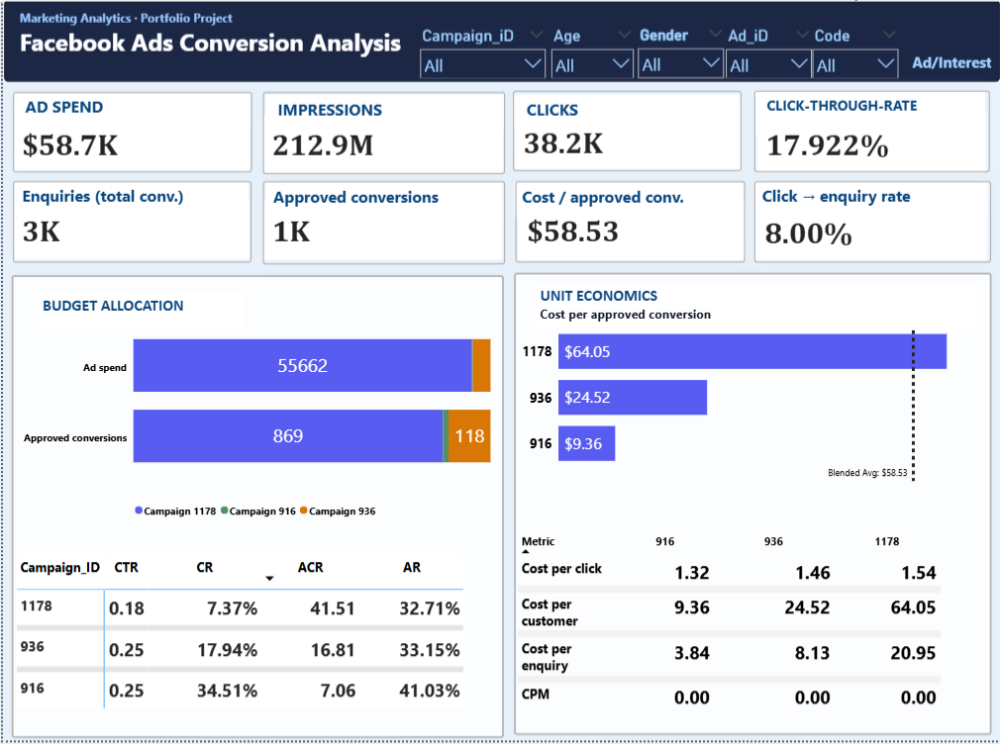
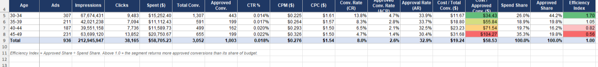
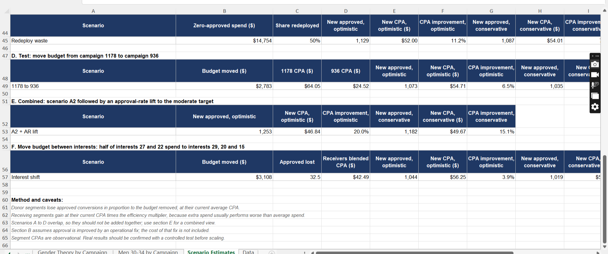

# Marketing Campaign Performance Analysis

## 📌 Overview
End-to-end analysis of a Facebook ad campaign dataset (1,143 ads, $58,705 spend, 212M impressions) using Excel and Power BI. The analysis identifies audience segments with the highest ROI, exposes wasted spend, and provides data-driven budget reallocation recommendations with quantified impact estimates.

## 🎯 Business Questions
1. Which audience segments (age, gender) deliver the lowest cost per approved conversion?
2. Is budget allocated efficiently across campaigns?
3. How much spend goes to ads that produce zero approved conversions?
4. What is the approval rate, and can it be improved?

## 🛠️ Tools & Skills
- **Excel:** PivotTables, SUMIFS/COUNTIFS, IFERROR, Data Validation, Conditional Formatting, What-If Analysis
- **Power BI:** DAX, Data Modeling, Interactive Dashboards, Slicers, Drill-through
- **SQL:** Data extraction and aggregation
- **Analytics:** Segmentation, Cohort Analysis, Efficiency Index, Reconciliation, Scenario Modeling
- **Statistics:** Chi-square testing for significance

## 📊 Dataset
- **Source:** KAG_conversion_data.csv (Facebook Ads)
- **Scope:** 936 ads with ≥1 click (207 zero-click ads excluded)
- **Metrics:** Impressions, Clicks, Spend, Total Conversions, Approved Conversions
- **Key KPIs:** CTR, CPC, CPM, CR, ACR, AR, CPA

---

## 📈 Overall KPIs

| Metric | Value |
|--------|-------|
| Impressions | 212,945,947 |
| Clicks | 38,165 |
| Spend | $58,705.23 |
| Total Conversions | 3,052 |
| Approved Conversions | 1,003 |
| CTR | 0.018% |
| CPM | $0.276 |
| CPC | $1.54 |
| Conversion Rate (CR) | 8.0% |
| Approved Conversion Rate (ACR) | 2.6% |
| Approval Rate (AR) | 32.9% |
| Cost per Total Conversion | $19.24 |
| **Cost per Approved Conversion (CPA)** | **$58.53** |

Only one in three conversions is approved — the approval step is the biggest lever after targeting.

---

## 🔍 Key Findings

### 1. Age: Efficiency declines with age

| Age | Spend Share | Approved Share | CTR | CR | CPA | Efficiency Index |
|-----|-------------|----------------|-----|-----|-----|------------------|
| 30-34 | 26.0% | 44.2% | 0.014% | 13.8% | $34.43 | 1.70 |
| 35-39 | 18.9% | 19.8% | 0.017% | 8.3% | $55.84 | 1.05 |
| 40-44 | 19.7% | 16.2% | 0.020% | 6.5% | $71.54 | 0.82 |
| 45-49 | 35.3% | 19.8% | 0.022% | 4.7% | $104.27 | 0.56 |

**Insight:** Users 30-34 convert **3x better** than 45-49 ($34.43 vs $104.27 CPA), yet receive only 26% of budget. The 45-49 group is the largest budget line (35.3% of spend) and the most expensive per result.

### 2. Gender: Men convert, women click

| Gender | Ads | Spend Share | Approved Share | CTR | CPC | CR | AR | CPA |
|--------|-----|-------------|----------------|-----|-----|-----|-----|-----|
| Men | 473 | 41.2% | 53.4% | 0.015% | $1.69 | 10.5% | 35.9% | $45.15 |
| Women | 463 | 58.8% | 46.6% | 0.021% | $1.45 | 6.5% | 30.0% | $73.88 |

**Insight:** Women click more cheaply (lower CPC) but convert worse. Men also have a higher approval rate, so the gap exists both before and after the approval step. **Men cost 39% less per approved conversion** ($45.15 vs $73.88).

**Statistical significance:** A chi-square test on approved conversions per click confirms the gender difference is statistically significant (p < 0.001), as is the difference between ages 30-34 and 45-49 (p < 0.001).

### 3. Age × Gender Combined

| Segment | Spend Share | Approved Share | CPA | Efficiency Index |
|---------|-------------|----------------|-----|------------------|
| Men 30-34 | 13.0% | 26.2% | $29.05 | 2.02 |
| Women 30-34 | 13.0% | 17.9% | $42.29 | 1.38 |
| Men 35-39 | 8.6% | 10.9% | $46.34 | 1.26 |
| Men 40-44 | 7.1% | 7.3% | $57.44 | 1.02 |
| Women 35-39 | 10.3% | 9.0% | $67.35 | 0.87 |
| Men 45-49 | 12.5% | 9.1% | $80.41 | 0.73 |
| Women 40-44 | 12.6% | 8.9% | $83.11 | 0.70 |
| Women 45-49 | 22.9% | 10.8% | $124.38 | 0.47 |

**Insight:** Women 45-49 absorb nearly a quarter of the budget ($13,433) at under half the average efficiency. Men 30-34 produce 26% of approved conversions from just 13% of spend — a 4.3x CPA gap between the best and worst segments.

### 4. Campaigns

| Campaign | Ads | Spend | Spend Share | Approved | CR | CPA | Efficiency Index |
|----------|-----|-------|-------------|----------|-----|-----|------------------|
| 916 | 35 | $150 | 0.3% | 16 | 34.5% | $9.36 | 6.26 |
| 936 | 288 | $2,893 | 4.9% | 118 | 17.9% | $24.52 | 2.39 |
| 1178 | 613 | $55,662 | 94.8% | 869 | 7.4% | $64.05 | 0.91 |

**Insight:** Campaign 1178 receives **94.8% of spend** at the worst CPA ($64.05). Campaigns 916 and 936 look far more efficient, but their budgets are tiny. A controlled budget test is the right way to find the real cause.

**Is the campaign gap explained by audience mix?** No. Even after controlling for gender and age, each campaign's cost advantage holds inside every audience group. The mix explains only **6.5% of the gap** between campaign 1178 and campaign 916. Something other than audience mix (creative, product, or interest targeting) is driving the difference.

### 5. Wasted Spend
- **423 ads** (45% of total) produced **zero approved conversions**
- **$14,754** spent with no measurable return (25.1% of total budget)

*Note: Some of these are young or low-volume ads that never had a fair chance — this is a review list, not an automatic cut list.*

### 6. Interest Categories

Top 10 interests take **65% of spend**. Among categories with at least $1,000 of spend:

| Category | Result |
|----------|--------|
| **Best CPA** | Interest 29 ($40.69, 8.6% of spend), interest 20 ($43.57), interest 15 ($45.57) |
| **Largest budget** | Interest 16 (13.8% of spend, CPA $60.34 — near average) |
| **Worst CPA** | Interest 27 ($97.66, 8.8% of spend) and interest 22 ($86.65) |

---

## 💡 Recommendations

### 1. Reallocate budget from women 45-49 to men and women 30-34
Women 45-49 have the lowest efficiency index (0.47). Moving half of that budget ($6,717) equally to men and women 30-34 would add roughly **76 to 141 approved conversions** and cut overall CPA by **7% to 12%**. Real CPA will rise as spend scales, so move in steps and monitor.

### 2. Test campaign 1178 against cheaper campaigns
Run a controlled test giving campaign 936 a meaningfully larger budget and compare CPA. Moving 5% of 1178's spend ($2,783) to 936 would cut overall CPA by **3% to 6.5%** if 936's results hold.

### 3. Fix the post-click experience for women
They click cheaply, so the problem is after the click: product fit, landing page, or sales follow-up. Lifting women's approval rate to the men's level (35.9%) would add about **91 approved conversions** and cut overall CPA by **8.3%**.

### 4. Fix the approval step
Two thirds of conversions are not approved. Raising the approval rate from 33% to 40% at today's volume would add about **218 approved conversions** (1,221 vs 1,003) at **no extra media cost** and cut CPA by **17.8%** ($58.53 → $48.09).

### 5. Audit the 423 zero-approval ads
Pause those with meaningful spend and no result; keep those with too little data to judge. Redeploying half of that spend at the blended CPA would cut overall CPA by **8% to 11%**.

### 6. Shift interest budget from 27 and 22 toward 29, 20, and 15
Moving half of the spend on interests 27 and 22 would cut overall CPA by **2% to 4%**.

---

## 📊 Estimated Impact of Recommendations

| Recommendation | Extra Approved Conv. | Overall CPA Change |
|----------------|---------------------|---------------------|
| Move half of women 45-49 budget ($6,717) to men + women 30-34 | +76 to +141 | −7.0% to −12.3% |
| Larger shift: half of women 45-49 + women 40-44 + men 45-49 ($14,074) | +128 to +265 | −11.3% to −20.9% |
| Move 5% of campaign 1178 budget ($2,783) to 936 | +32 to +70 | −3.1% to −6.5% |
| Women's approval rate rises to men's level (30.0% → 35.9%) | +91 | −8.3% |
| Approval rate 33% → 36% (or 40%) | +96 (or +218) | −8.7% (or −17.8%) |
| Redeploy half of zero-approved spend ($7,377) at blended CPA | +84 to +126 | −7.7% to −11.2% |
| Move half of interests 27 & 22 spend to interests 29, 20, 15 | +16 to +41 | −1.6% to −3.9% |
| **Combined: A2 + approval rate lift to 36%** | **+179 to +250** | **−15.1% to −20.0%** |

**Assumptions:**
- Total budget held constant ($58,705)
- Low end assumes new dollars cost **1.5×** the receiving segment's current CPA (diminishing returns)
- High end assumes new dollars perform at the receiving segment's current CPA
- Scenarios overlap — do not add rows together
- These are **scenario estimates from observational data**, not forecasts
- Recommendations 3 and 4 assume a successful operational fix whose cost is not included
- Confirm with a controlled test before scaling

---

## 📸 Dashboard Preview

### Power BI Dashboard

### Excel Analysis

---

## 📁 Files
- `excel/ad_performance_metrics.xlsx` — Full analysis with live formulas (12 sheets)
- `powerbi/marketing_campaign.pbix` — Interactive dashboard
- `report/ad_campaign_report.pdf` — Written report with scenario modeling
- `data/KAG_conversion_data.csv` — Cleaned dataset (936 ads)

---

## ⚠️ Limitations
- **No dates** in the data → trends, seasonality, and ad fatigue cannot be assessed
- **No revenue or margin** → results are cost-per-conversion, not ROI. A cheap conversion is only good if its value holds up
- **Segment CPAs on small budgets** (campaigns 916, 936, small interest categories) are unstable — treat as directional
- **Findings describe association**, not causation. Targeting was not randomized, so differences between audiences may partly reflect creative, product, or budget decisions
- **Interpretation:** "Total Conversion" = leads; "Approved Conversion" = purchases (standard reading of this dataset)

### Data Quality Notes
Several statements in the original source notes did not match the data:
- *"More than 90% of customers came from campaign 1178"* → actual figure: **86.6%** of approved conversions
- *"99% spend share in campaign 1178"* → actual figure: **94.8%**
- *"It costs us half what we are costing others"* → actual: men cost **39% less** per approved conversion ($45.15 vs $73.88), a large gain but not half

The notes' main directions were confirmed: young audiences convert most, older audiences click most and convert least, and men are cheaper to acquire.

---

## 🧮 Methodology

### Efficiency Index
`Approved Share ÷ Spend Share`

- **> 1.0** = segment returns more approved conversions than its share of budget (under-invested)
- **< 1.0** = segment under-delivers relative to its budget share (over-invested)

### Reconciliation
The raw CSV contains 1,143 ads. The analysis scope excludes 207 ads with **0 clicks and $0 spend**, since pay-per-click billing means these ads cost nothing. The workbook's `Reconciliation` sheet shows the raw CSV totals against the analysis scope, confirming no cost metric is affected by the exclusion.

### Scenario Modeling
Scenario estimates are built in the workbook's `Scenario Estimates` sheet with editable assumptions:
- Efficiency multiplier (optimistic = 1.0, conservative = 1.5)
- Share of zero-approved spend redeployed (50%)
- Share of campaign 1178 budget moved to 936 (5%)
- Target approval rates (36% moderate, 40% strong)

---

## 👤 Author
**Esraa Rashwan** — Marketing Data Analyst
- LinkedIn: [linkedin.com/in/esraa-rashwan7](https://linkedin.com/in/esraa-rashwan7)
- GitHub: [github.com/Esraarashwan](https://github.com/Esraarashwan)
- Email: esraa.r2015g@gmail.com